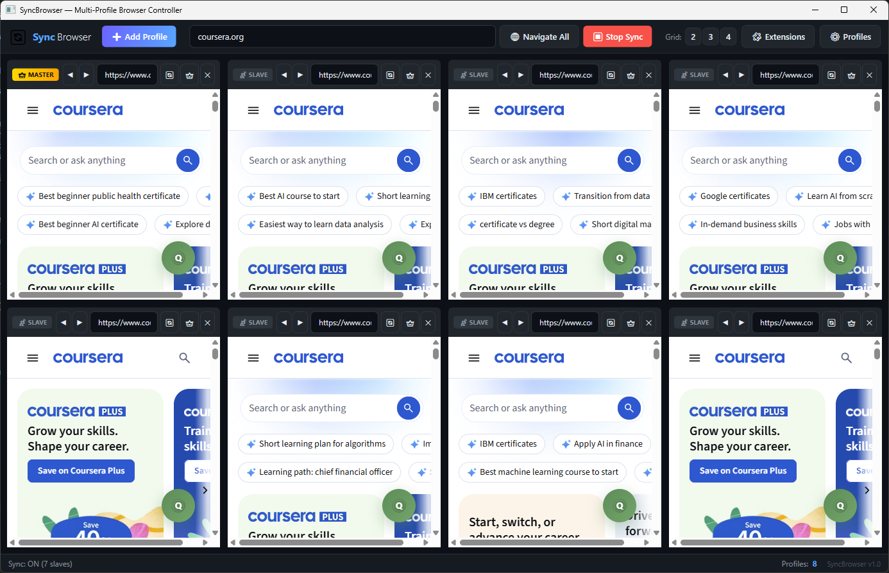

# SyncBrowser

A multi-profile browser controller built with WPF and WebView2. Run multiple isolated browser sessions side-by-side and synchronize input from a master browser to all slaves in real time.



## Features

- **Multi-Profile Browsing** — Each profile runs in its own isolated WebView2 environment with separate cookies, storage, and session data.
- **Master/Slave Sync** — Designate any tab as the master. Mouse movements, clicks, keyboard input, and scrolling are replicated to all slave browsers via Chrome DevTools Protocol (CDP).
- **Extension Support** — Load unpacked browser extensions into all profiles through the built-in Extension Manager.
- **Profile Management** — Create, delete, and configure profiles with custom proxy servers and user agents.
- **Adaptive Grid Layout** — Display 2, 3, or 4 columns; the grid auto-adjusts based on profile count.
- **Dark Theme UI** — GitHub-inspired dark theme with color-coded profile borders.

## Architecture

The solution follows **Clean Architecture** with three projects:

```
SyncBrowser.slnx
└── src/
    ├── SyncBrowser.Core          # Domain models, interfaces, services (no framework dependencies)
    ├── SyncBrowser.Infrastructure # WebView2 factory, CDP dispatcher, JSON repositories
    └── SyncBrowser.App            # WPF UI, ViewModels, Views, Themes
```

### Design Patterns

| Pattern | Usage |
|---------|-------|
| **MVVM** | `ViewModelBase`, `RelayCommand`, `AsyncRelayCommand` — data binding between Views and ViewModels |
| **Mediator** | `SyncMediator` — coordinates input synchronization between master and slave browsers |
| **Strategy** | `IInputDispatcher` / `CdpInputDispatcher` — dispatches input actions via CDP |
| **Factory** | `IBrowserFactory` / `WebView2BrowserFactory` — creates isolated WebView2 environments per profile |
| **Repository** | `IProfileRepository` / `JsonProfileRepository` — persists profiles to JSON |
| **Command** | `InputAction` hierarchy (`MouseAction`, `KeyboardAction`, `ScrollAction`) — encapsulates replayable input events |

### Sync Pipeline

```
JS Capture (master)
    │  mouse/keyboard/scroll events at ~60fps
    ▼
WebMessageReceived → OnInputCapturedAsync
    │  writes to bounded Channel<InputAction>
    ▼
Background Dispatch Loop (UI SynchronizationContext)
    │  coalesces mouse moves (latest-wins)
    │  accumulates scroll deltas (sum)
    ▼
Task.WhenAll → CdpInputDispatcher
    │  parallel CDP calls to all slaves
    ▼
Input.dispatchMouseEvent / Input.dispatchKeyEvent (per slave)
```

**Performance optimizations:**
- **Parallel dispatch** — All slaves receive input simultaneously via `Task.WhenAll`, reducing latency from O(n) to O(1).
- **Input coalescing** — Consecutive mouse moves are merged (latest position wins); consecutive scrolls are accumulated (deltas summed) so no scroll distance is lost.
- **Bounded channel** — A `Channel<InputAction>` with capacity 128 decouples capture from dispatch, preventing UI thread blocking.

## Tech Stack

| Component | Technology |
|-----------|------------|
| Framework | .NET 8, WPF |
| Browser Engine | Microsoft WebView2 (`1.0.3912.50`) |
| Dependency Injection | `Microsoft.Extensions.DependencyInjection` (`10.0.6`) |
| Input Sync | Chrome DevTools Protocol (CDP) via `CallDevToolsProtocolMethodAsync` |
| Persistence | JSON files in `%AppData%/SyncBrowser/` |

## Project Structure

```
src/
├── SyncBrowser.Core/
│   ├── Enums/
│   │   ├── InputActionType.cs       # MouseMove, MouseDown, KeyDown, Scroll, ...
│   │   ├── MouseButton.cs           # Left, Right, Middle, None
│   │   └── ProfileStatus.cs         # Inactive, Loading, Active, Error
│   ├── Events/
│   │   ├── InputCapturedEventArgs.cs
│   │   └── SyncStatusChangedEventArgs.cs
│   ├── Interfaces/
│   │   ├── IBrowserFactory.cs        # Creates isolated WebView2 environments
│   │   ├── IExtensionManager.cs      # Manages extension folder paths
│   │   ├── IInputDispatcher.cs       # Dispatches input via CDP
│   │   ├── IProfileRepository.cs     # Profile persistence
│   │   └── ISyncMediator.cs          # Master/slave coordination
│   ├── Models/
│   │   ├── BrowserProfile.cs         # Profile entity (name, proxy, user agent, color)
│   │   ├── InputAction.cs            # Base class for input events
│   │   ├── KeyboardAction.cs
│   │   ├── MouseAction.cs
│   │   └── ScrollAction.cs
│   └── Services/
│       ├── ProfileManager.cs         # Profile CRUD + auto user data folders
│       └── SyncMediator.cs           # Channel-based sync with coalescing
│
├── SyncBrowser.Infrastructure/
│   ├── Dispatchers/
│   │   └── CdpInputDispatcher.cs     # CDP mouse/keyboard/scroll dispatch
│   ├── Factories/
│   │   └── WebView2BrowserFactory.cs # WebView2 environment + extension support
│   └── Repositories/
│       ├── JsonProfileRepository.cs  # Profiles → profiles.json
│       └── JsonExtensionManager.cs   # Extensions → extensions.json
│
└── SyncBrowser.App/
    ├── App.xaml / App.xaml.cs         # DI container setup
    ├── MainWindow.xaml / .cs          # Main window + toolbar
    ├── Converters/
    │   ├── BoolToVisibilityConverter.cs
    │   └── ProfileStatusToColorConverter.cs
    ├── Themes/
    │   └── DarkTheme.xaml             # GitHub-style dark theme
    ├── ViewModels/
    │   ├── ViewModelBase.cs           # INotifyPropertyChanged base
    │   ├── RelayCommand.cs            # ICommand + AsyncRelayCommand
    │   ├── MainViewModel.cs           # Tab management, sync, navigation
    │   ├── BrowserTabViewModel.cs     # Single browser tab state
    │   ├── ProfileManagerViewModel.cs # Profile CRUD dialog
    │   └── ExtensionManagerViewModel.cs # Extension management dialog
    └── Views/
        ├── BrowserTabView.xaml / .cs  # WebView2 control + JS input capture
        ├── ProfileManagerWindow.xaml / .cs
        └── ExtensionManagerWindow.xaml / .cs
```

## Getting Started

### Prerequisites

- [.NET 8 SDK](https://dotnet.microsoft.com/download/dotnet/8.0)
- Windows 10/11 with [WebView2 Runtime](https://developer.microsoft.com/en-us/microsoft-edge/webview2/) (pre-installed on most systems)

### Build & Run

```bash
git clone https://github.com/davidtheheroes/SyncBrowser.git
cd SyncBrowser
dotnet build
dotnet run --project src/SyncBrowser.App
```

### Usage

1. **Add profiles** — Click `➕ Add Profile` or open `⚙ Profiles` to create profiles with custom proxy/user agent.
2. **Navigate** — Type a URL in the top bar and press Enter or click `🌐 Navigate All` to open it in every profile.
3. **Sync input** — Click `▶ Start Sync`. All mouse, keyboard, and scroll actions on the master (👑) are mirrored to all slaves (📡).
4. **Switch master** — Click the 👑 button on any tab to promote it to master.
5. **Manage extensions** — Click `🧩 Extensions` to add unpacked extension folders. Extensions are loaded into all profiles.
6. **Grid layout** — Use the `2` / `3` / `4` buttons to change the column layout.

## Data Storage

All data is stored in `%AppData%/SyncBrowser/`:

| File/Folder | Content |
|-------------|---------|
| `profiles.json` | Profile configurations |
| `extensions.json` | Extension folder paths |
| `Profiles/{id}/` | Isolated WebView2 user data per profile |

## License

MIT
